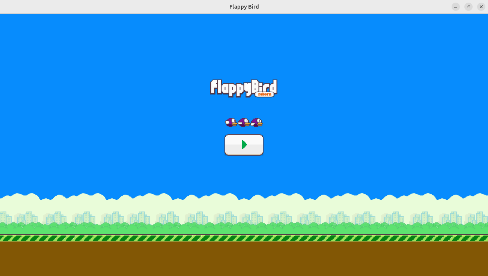
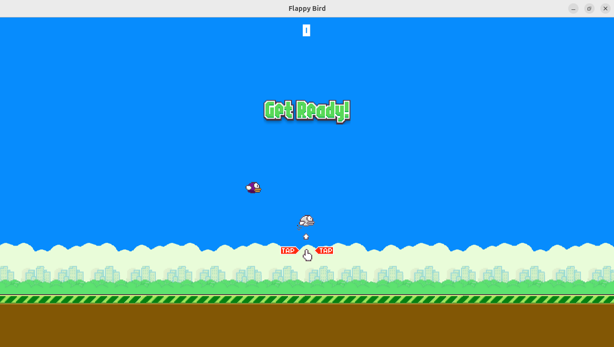
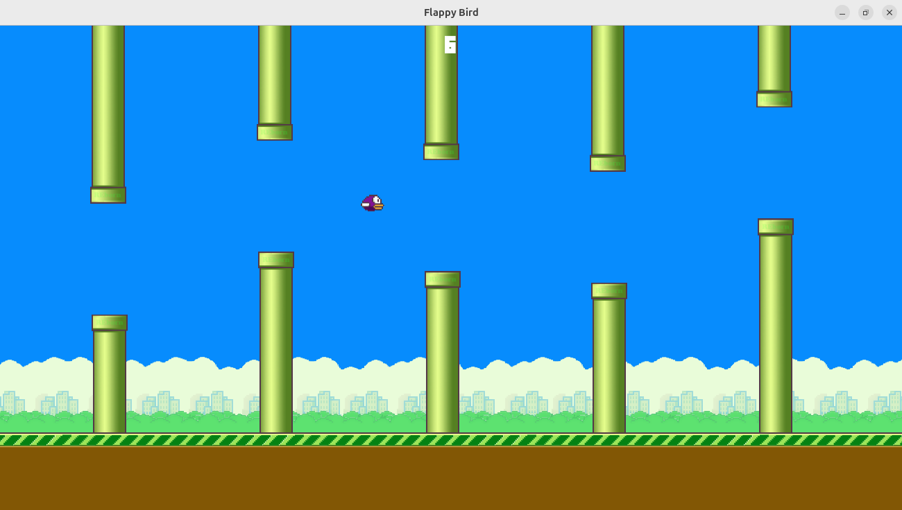
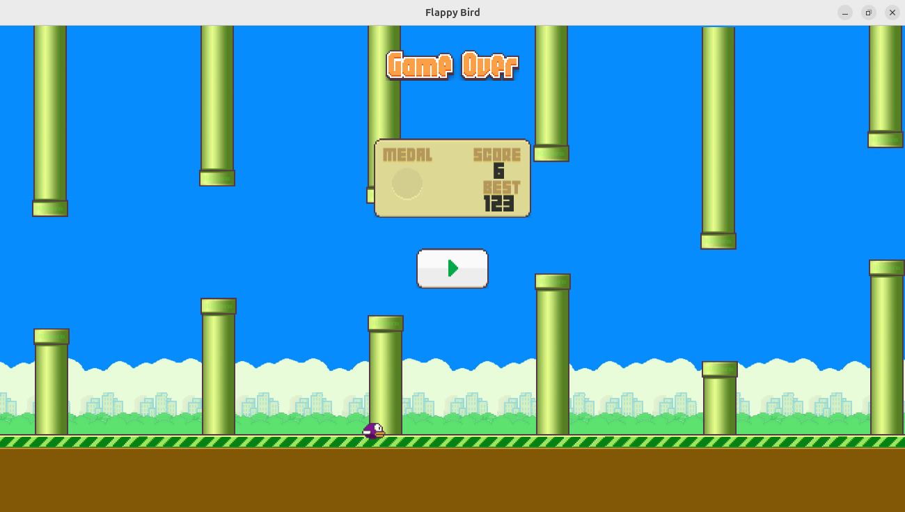

# Flappy Birds in Rust + Macroquad

A nostalgic clone of the classic Flappy Bird, built using [Rust](https://www.rust-lang.org/) and the [Macroquad](https://github.com/not-fl3/macroquad) game library.

## Game Preview

### Title Scene



### Instructions



### Game Scene



### Game Over



## How to Run

```bash
git clone https://github.com/Praveen-chinthaginjala/Flappy_Birds.git
cd Flappy_Birds
cargo run --release
```

## How to Test
```bash
cargo test
```

## Features
- Procedurally generated pipes
- Score tracking and display
- Smooth physics and collision
- Title scene and game over screen
- Written 100% in safe Rust
- Async game state transitions
- Modular architecture (prefabs, scenes, systems)

## Tech Stack
- Rust
- Macroquad
